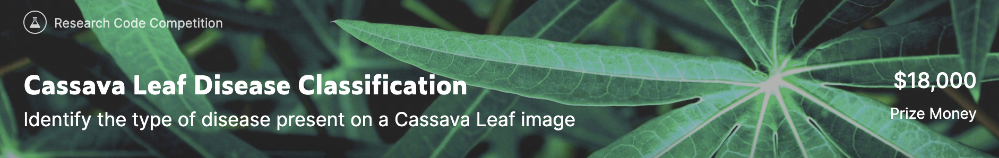
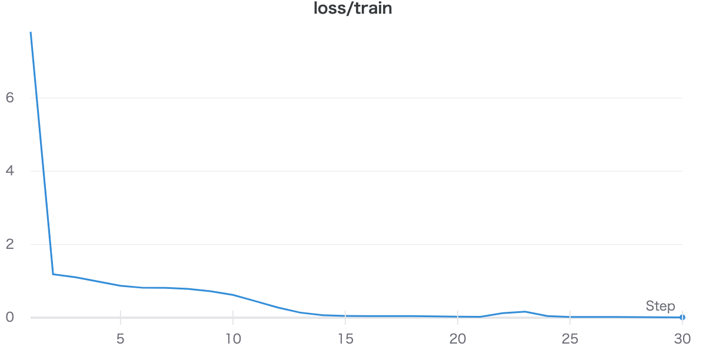
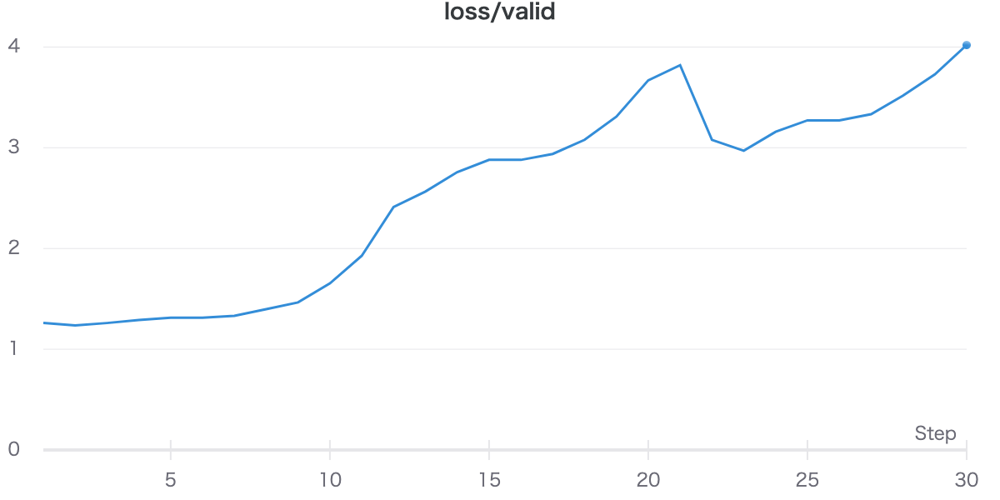

# Cassava_leaf_disease

Kaggle diary for Cassava Leaf Disease Classification.

このリポジトリはCassava Leaf Disease ClassificationのKaggle日記です。

### コンペ情報
画像分類コンペ、タピオカの葉の画像から、病気の状態を予想する。病気の種類は、正常な状態を含めて5つ存在する。

## Timeline

1/22 (本格的に)joined
2/19 deadline
##　目標
1/24時点
金　上位16
銀　上位153
銅　上位306
最低でも銅メダルは取りたい。expert目指すことも考えたら銀も狙いに行かないと。

### 1/24
一応Notebookは完成したが、なぜかtrain_lossとvalidation_lossが反対に動いてしまう...

### 1/31
紆余曲折を経て、バグを取り除くことに成功した。加えて、自分が納得の行く画像分類タスク用のpipelineを得た。
やっとスタートラインに立てた気がする。

|experiment_name |experiment_1|
|----|----|
|model_arch |resnext50_32x4d|
|img_size |256|
|epochs |15|
|train_bs |32|
|valid_bs |32|
|T_max|15|
|lr|0.0001|
|num_workers |2|

|result |experiment_1|
|----|----|
|train_loss|0.2711|
|valid_loss|0.4091|
|train_accuracy|0.9051|
|valid_accuracy|0.8654|

とりあえず実験はうまくいった

